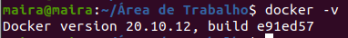

# Oque é Docker ?

É uma plataforma aberta para desenvolvimento, envio e execução de aplicativos, permitindo que separe seus softwares de forma rápida.

## Arquitetura Docker.

Usa um sistema tipo cliente-servidor, onde o cliente se comunica com o *daemon* Docker, que constroi, executa e distribui seus *contêiners* Docker, que se conecta utilizando uma API REST.

- **Daemon Docker** : Escuta as solicitações da API, gerencia imagens, contêiners, redes e volumes. 

- **Contêiners** : é uma instância executavel de uma imagem, isolado, controlavel, gerenciavel, quando um *contêiner* é removido todas as alterações em seu estado de armazenamento são excluidos. 
 
 - **Docker Compose** : É o cliente do Docker que permite trabalhar com varios aplicativos juntos com vários contêineres.
 
- **Dockerfile** : é o arquivo de configuração da imagem. Pense nele como uma receita. 


# Instalação e configuração do Docker. 

Recomenda-se que instale dessa forma em um sistema operacional como o ubuntu ou Debian, para windows e macos há versões Desktop próprias. 

```html
https://www.docker.com/get-started
```

Atualize o sistema com o comando:

```bash
sudo apt-get update
```

Instale os requisitos necessários com o comando:

```bash 
sudo apt-get install apt-transport-https ca-certificates curl gnupg2 software-properties-common -y
```

Baixe a chave GPG para a instalação do Docker com o comando:

```bash 
curl -fsSL https://download.docker.com/linux/$(. /etc/os-release; echo "$ID")/gpg | sudo apt-key add -
```

Verifique a chave e sua assinatura com o comando:

```bash 
apt-key fingerprint 0EBFCD88
```

Adicionando o docker ao repositorio do sistema:

```bash
sudo add-apt-repository "deb [arch=amd64] https://download.docker.com/linux/$(. /etc/os-release; echo "$ID") $(lsb_release -cs) stable"
```

Atualize novamente o sistema com o comando:

```bash
sudo apt-get update
```

Pesquise pelo Docker no repositorio com o comando:

```bash 
sudo apt-cache search docker-ce
```

Realize a instalação do Docker com o comando:

```bash 
sudo apt-get install docker-ce -y
```

Instale tambem o Docker compose com o comando:

```bash
sudo apt-get install docker-compose -y
```

Pronto, para verificar a instalação use o comando:

```bash
docker -v
```




Todos esses comandos estão prontos em um script montado pelo Greenmind em seu git, de onde tambem eu tirei todos esses comandos e o principal inspirador para eu estudar docker.  :green_heart:

Use o comando para baixar o script dele caso não queira fazer comando por comando como à cima:

```bash 
wget https://gist.githubusercontent.com/greenmind-sec/e191481b4fa6ab33b3ed1250e9aaf66a/raw/c701da9ec1b8bb65038c80d55b972598c21058af/install-docker.sh
```

Lembre-se de dar permissão de execução tambem:

```bash 
chmod +x install-docker.sh
```

E execute o script com o comando:

```bash
sudo ./install-docker.sh
```

> Não faça duas instalações, pode dar problemas.


# Onde encontrar os Contêiners.

O docker pensou em tudo, fornecendo uma especie de rede social onde você compartilha seus contêiners e pode baixar o de outras pessoas tambem, você encontra inúmeros serviços nos contêiners ali disponiveis, tem muitos aplicativos, oficiais e não oficiais, testado à vulnerabilidades para manter sua segurança e tambem os que não são testados. 
Acesse a rede pelo link:

```html 
https://hub.docker.com/
```

É bem intuitivo, você pesquisa pelo serviço que deseja, clica em cima, procure por selinhos de imagens oficiais, as mais confiavéis ok. 

Sempre haverá um comando a sua direita para copiar e colar em seu terminal para executar o serviço. 

Mais uma dica legal, clique em Tags, lá teram as ultimas versões, com informações sobre as ultimas vulnerabilidades testadas e tambem o comando a sua direita da tela para copiar e colar no terminal. 


# Principais comandos do Docker. 


O melhor comando em todas as boas ferramentas é o de **ajuda** então use o comando:

```bash
docker --help
```

Para obter uma imagem ou seja **baixar**, do Dockerhub ou de outro servidor de imagens, use o comando:
> por padrão vem do dockerhub se não especificar ok.

```bash
docker pull ubuntu
```

Para **listar** as imagens existentes em seu sistema, use o comando: 

```bash
docker images
```

Para **iniciar** um novo container use o comando:
> lembre-se que vai precisar sempre de uma imagem, de um servidor ou sua. 
```bash
docker run
```

Para **executar** um container em modo **background**, ou seja que não exiba os detalhes, que execute o container em segundo plano e mostre apenas o ID do container no terminal. 
> o **-d** é para iniciar em background

```bash
docker run -d nomedocontainer
```

Para **acessar** o container e **exclui-lo** quando sair, use o comando:

```bash
docker run -it --rm debian
```

Para **listar** os containers que estão em funcionamento:
```bash
docker ps
```

Para **nomear** um container use o comando:

```bash
docker --name "nome_que_deseja" httpd
```

Para **direcionar** uma porta para o container use o comando:

> porta_host:porta_container

```bash
docker run --name "nome_que_deseja" -p 80:80 httpd
```

Sobre **compartilhamento** de pastas, é possivel fazer com que o diretório atual compartilhe arquivos com uma pasta especificada no comando dentro do container.

>**pwd**: é um comando que lista o diretório atual. 
```bash
docker run -d --name server_web -v "${PWD}:/usr/local/apache2/htdocs" -p 80:80 httpd
```
As **conexões** com os serviços nos containers são muito importantes, isso porque os containers funcionam de forma **isolada** e para realizar essa conexão é necessario a **criação de portas**.

>Lembrando que alguns projetos funcionam via linha de comando e não tem a necessidade de abrir uma porta de conexão.

```bash
docker run -it --rm -p 80:80 httpd
```
Para **setar** a quantidade de **processamento** que o container pode utilizar use o comando:

>Para setar a quantidade de memória **RAM** que vai ser usada passando o **-m**.

```bash
docker run -it --rm -m 512M httpd
```

Agora se deseja **setar** o processamento da **CPU** use este comando com o parametro **-c**
> se não der valor ele por padrão colocará o maior peso que é 1024.
```bash
docker container run -it --rm -c 512 httpd
```

Para **parar** um container use o comando:

```bash
docker container stop nome_do_container
```

Ou para **iniciar** um container:

```bash
docker container start nome_container
```

# Criando uma pilha LAMP com o Docker Compose

Vamos relembrar oque é LAMP ? :raised_hands: :raised_hands: :raised_hands: :raised_hands: 

**L**inux, **A**pache, **M**ySQL, **P**HP.

Caso você não esteja associado a este assunto, visite o repositório no meu perfil @M41R40 :ok_woman: no link abaixo: 

```html
https://github.com/M41R40/Servidor-ubuntu-c-pilha-LAMP---DigitalOcean
```


